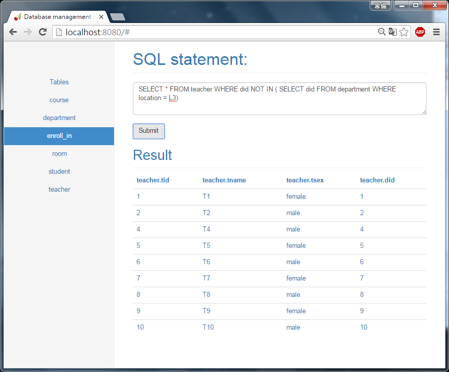

# Mini DBMS - Project for course "Database management system" 
Screen shot:

Environment:

	python 2.7, cherrypy, windows7, chrome

How to use?

	1. ~/DBMS >> python webapp.py
	2. open chrome and enter "localhost:8080"
